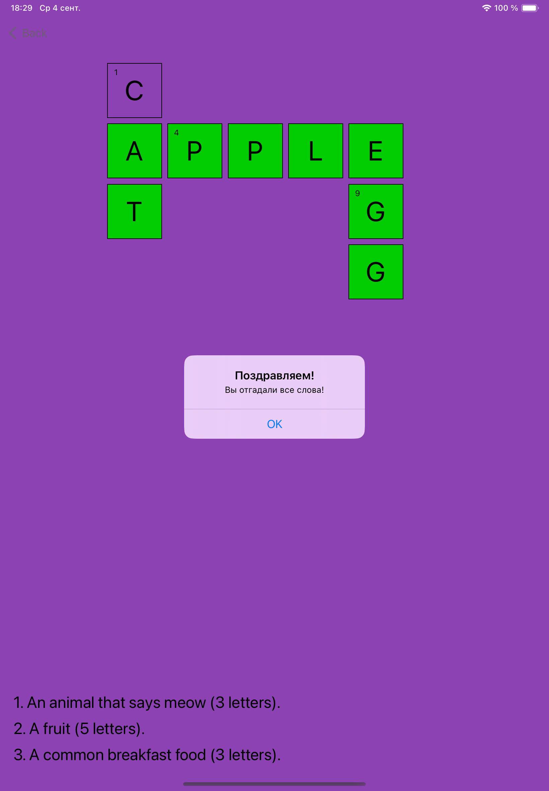
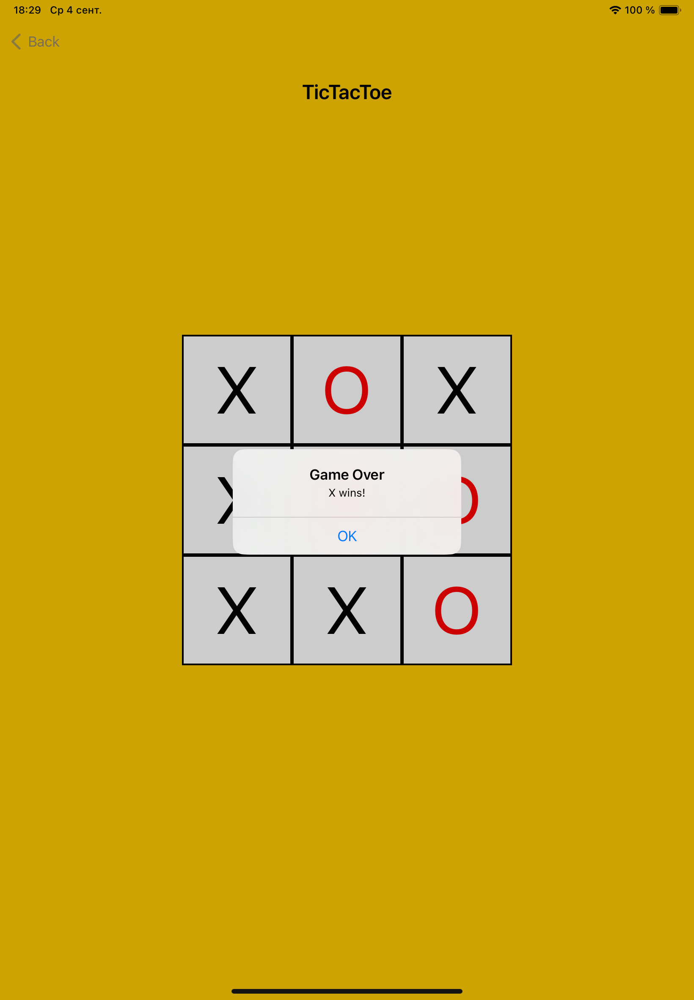
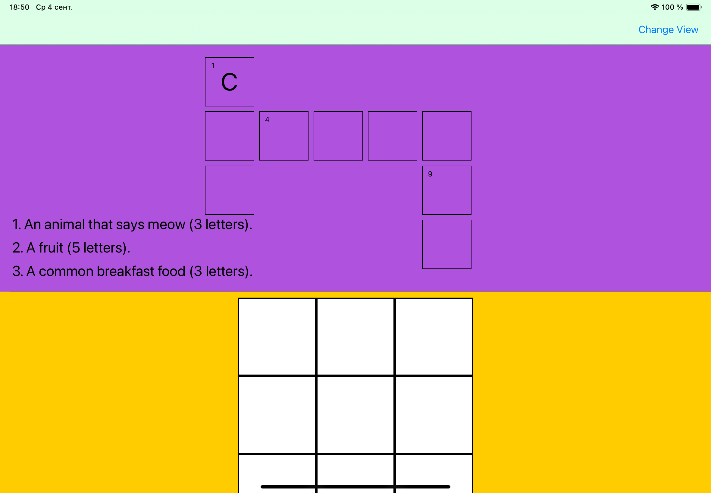

# Коллекция Мини-Приложений: Погода, Информация о городе, Кроссворд и Крестики-Нолики

## Описание

**Коллекция Мини-Приложений** — это iOS-приложение, содержащее несколько небольших мини-приложений: виджет погоды, информацию о текущем городе, кроссворд и игру Крестики-Нолики. Эти мини-приложения разработаны для демонстрации адаптивного интерфейса и переиспользуемых компонентов.

## Основные Функции

- **Режимы Отображения:**
  - **Режим Предпросмотра:** Элементы занимают 1/8 высоты экрана и недоступны для взаимодействия.
  - **Интерактивный Режим:** Элементы занимают 1/2 высоты экрана и доступны для взаимодействия.
  - **Полноэкранный Режим:** Полноэкранное взаимодействие с мини-приложениями.

- **Адаптивный Дизайн:** Используется библиотека `SnapKit` для создания отзывчивого интерфейса, который поддерживает различные размеры экранов, включая iPad.

- **Разнообразие Мини-Приложений:**
  - **Виджет Погоды:** Показ текущей температуры.
  - **Информация о Городе:** Данные о текущем городе по геолокации.
  - **Кроссворд:** Простой кроссворд с тремя словами.
  - **Крестики-Нолики:** Классическая игра с адаптивным интерфейсом.

## Скриншоты

### iPad

<table>
  <tr>
    <td align="center"></td>
    <td align="center"></td>
    <td align="center"></td>
    <td align="center"></td>
    <td align="center"></td>
    <td align="center"></td>
    <td align="center"></td>
    <td align="center"></td>
  </tr>
</table>

### iPhone

<table>
  <tr>
    <td align="center"></td>
    <td align="center"></td>
    <td align="center"></td>
    <td align="center"></td>
    <td align="center"></td>
  </tr>
</table>

## Технические Детали

- **Swift и UIKit:** Приложение полностью написано на Swift с использованием UIKit, без использования SwiftUI.
- **Библиотеки:** Для работы с сетью и создания интерфейса используются `Alamofire` и `SnapKit`.
